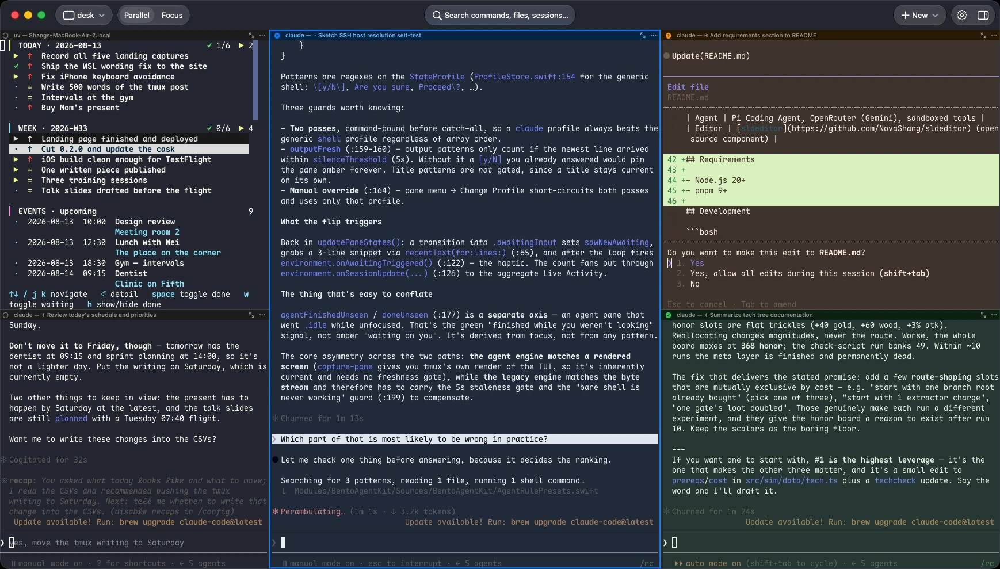

# Bento Term

English | [简体中文](README_CN.md)

[](https://github.com/NovaShang/BentoTerm/releases/latest)
[](LICENSE)

A terminal for running and supervising multiple CLI coding agents at once.
Native macOS, iPhone and iPad clients on top of tmux control mode (`-CC`), with
client-side agent state detection, push-to-talk voice input, and libghostty
rendering.

<p align="center"></p>

Website: [bentoai.dev/term](https://bentoai.dev/term/) · Install: `brew install --cask NovaShang/tap/bento-term` · iPhone/iPad: App Store review in progress

## What it does

- **Attaches to real tmux sessions** via control mode. tmux is bundled for machines that don't have it; if you already run tmux, Bento attaches to your existing server and any other tmux client stays in sync — layouts, panes and scrollback live in tmux, not in the app.
- **Detects each pane's agent state** — working / awaiting input / done-and-unread / idle — from pane output, title and process info, entirely client-side. The state is shown as a color on the pane title bar and in the sidebar. Ten CLI profiles ship built-in (Claude Code, Codex, Gemini CLI, OpenCode, Cursor Agent, Copilot CLI, Amp, OpenClaw, Hermes, Antigravity); each profile's patterns are editable, and new profiles can be added for arbitrary tools. Detection requires no cooperation from the agent and injects nothing into the shell.
- **Two layouts over the same session:** Parallel tiles every pane; Focus gives one pane the window with the rest in a sidebar. Switching rearranges the actual tmux panes rather than maintaining a separate view state.
- **Push-to-talk voice input.** Hold right-click on a pane and speak; the transcript lands in that pane's input. Recognition vocabulary is biased by on-screen text, so identifiers and file names from the visible scrollback transcribe correctly, including mixed Chinese/English. Engines: Apple on-device (default), Qwen and OpenAI realtime — via Bento's relay, or directly with your own API key. Speech can also be translated into a shell command.
- **File tree and preview.** Every pane exposes the file tree of its working directory. Printed paths are clickable — resolved even when a TUI wrapped or truncated the line — and open with syntax highlighting and jump-to-line (`path:42`). PDFs, images and other documents open via Quick Look. The same tree works from iOS over the SSH connection.
- **Pane management as tmux operations.** Splits, drag-to-dock between positions and across sessions, duplication — each is executed as a real tmux `split-window` / `move-pane`, so a plain `tmux attach` from elsewhere shows exactly the same layout.
- **iOS/iPadOS client** attaches to the same sessions mid-run over SSH, with the same state detection.

## Architecture

| Layer | Choice |
|---|---|
| Terminal rendering | [libghostty](https://ghostty.org) — every pane is a real GPU-accelerated terminal surface (GhosttyKit xcframework), not a webview or a from-scratch emulator |
| Multiplexing | tmux control mode (`-CC`), with tmux bundled and [`BentoTmuxKit`](Modules/BentoTmuxKit/) as our own strict, heavily-tested protocol client |
| Apps | Native Swift end to end — AppKit/SwiftUI on macOS, UIKit/SwiftUI on iOS — as thin shells over the shared [`Modules/`](Modules/) packages |
| Agent state detection | Client-side heuristics over pane output, titles, and process info — per-agent profiles, no SDK hooks |
| SSH | macOS rides your system OpenSSH, so `~/.ssh/config`, ControlMaster, and jump hosts all just work; a remote host needs only `sshd` + `tmux` |
| Voice | A `SpeechEngine` abstraction over Apple on-device, OpenAI, and Qwen realtime ASR, with on-screen-context vocabulary biasing |

Two design rules shape everything:

1. **tmux is the source of truth.** The app renders and edits tmux state; it never owns a private copy. That's why sessions outlive the app and why any other tmux client agrees with what Bento shows.
2. **Transport is dumb, clients are smart.** Everything works over a plain local shell or vanilla SSH. Agent detection and terminal intelligence live entirely in the client and never move server-side. Nothing is installed on the remote machine.

## Install

Requirements: macOS 14+ on Apple Silicon.

```sh
brew install --cask NovaShang/tap/bento-term
```

Or download `BentoTerm-macos-arm64.zip` from the [latest release](https://github.com/NovaShang/BentoTerm/releases/latest) and drag `BentoTerm.app` into `/Applications` — signed and notarized.

The app is self-contained (tmux bundled). A remote machine needs only `sshd` and
`tmux`; reachability (NAT, VPN, Tailscale, jump hosts) is handled by your
`~/.ssh/config` — there is no relay and no host-side component.

## Privacy

- No accounts.
- Terminal output never leaves your machines; the connection is plain SSH.
- Telemetry is off by default and opt-in — a closed set of event names, never terminal content, commands, paths or hostnames.
- Voice audio goes to the speech provider through Bento's relay (keys live server-side), or directly with your own key. Details: [privacy page](https://bentoai.dev/privacy/).

## Repository layout

| Directory | What it is |
|---|---|
| `BentoTermMac/` | macOS app — AppKit/SwiftUI shell |
| `BentoTermiOS/` | iOS / iPadOS app — UIKit/SwiftUI shell |
| `Modules/BentoTmuxKit/` | tmux control-mode (`-CC`) protocol client |
| `Modules/BentoGhosttyKit/` | Terminal surfaces over libghostty |
| `Modules/BentoAgentKit/` | Agent detection rules and pane state |
| `Modules/BentoSessionKit/` | Session, window and pane logic |
| `Modules/BentoVoiceKit/` | Speech engines and the voice controller |
| `Modules/BentoFilePreviewKit/` | Path resolution and rich file preview |
| `Modules/BentoUISharedKit/` | UI shared across both platforms |
| `Modules/BentoFoundationKit/` | Logging and low-level shared utilities |
| `Modules/GhosttyKit/` | libghostty as a binary xcframework target |
| `docs/` | PRD, design docs, bug tracker |

## Building from source

You need Xcode 26+. GhosttyKit — libghostty packaged as an xcframework — is fetched automatically as a Swift Package binary target. A build-phase script runs `scripts/fetch-bundled-tmux.sh` to pull the prebuilt tmux pinned in `scripts/bundled-tmux.version` and embeds it at `BentoTerm.app/Contents/MacOS/helpers/tmux`; it needs the `gh` CLI, and without it the app falls back to a system tmux.

```sh
git clone https://github.com/NovaShang/BentoTerm.git && cd BentoTerm
xcodebuild -project BentoTerm.xcodeproj -scheme BentoTermMac -configuration Release build
```

The `BentoTermMac` scheme is the macOS app; the `BentoTermiOS` scheme is iOS. If you change `project.yml`, regenerate the project with [XcodeGen](https://github.com/yonaskolb/XcodeGen).

## License

[Apache-2.0](LICENSE)
